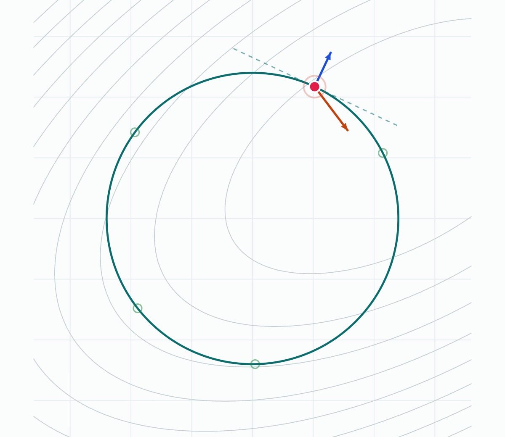
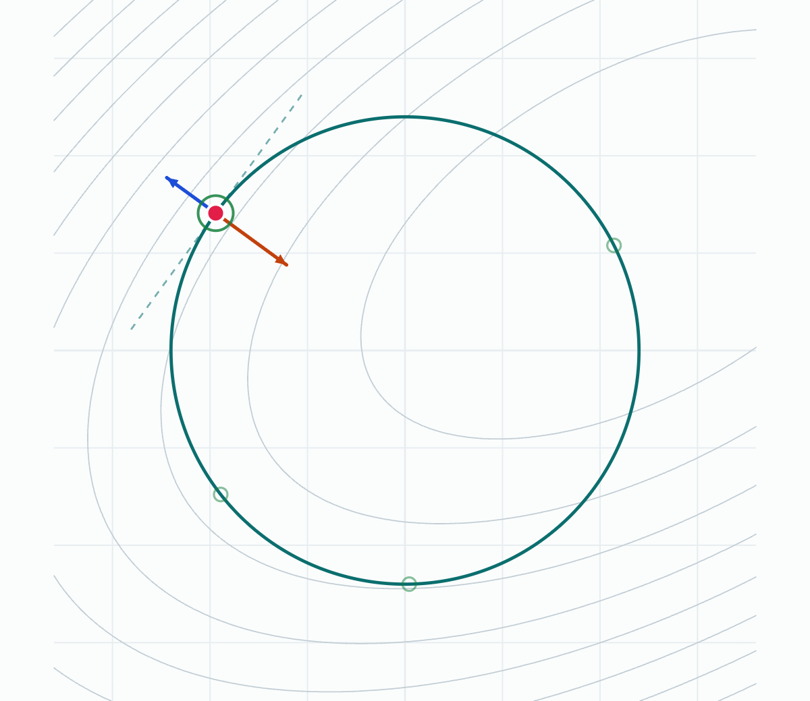
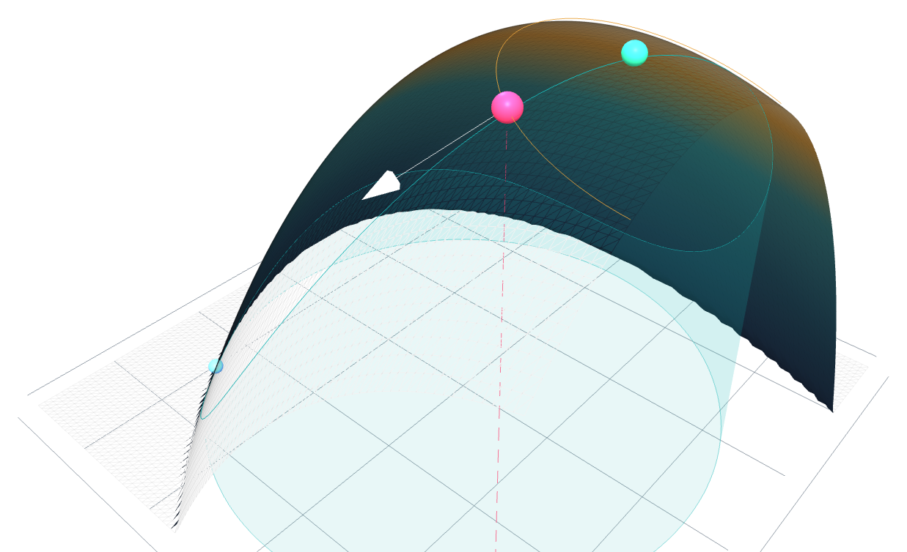

# Lagrangian Methods in Robotics

Interactive visualizations of **Lagrange multipliers** — the math under trajectory optimization, model predictive control (MPC), and the KKT conditions. Two single-file, dependency-light web visualizations that make the core geometry tangible.

> **The whole idea in one line:** at a constrained optimum, the constraint curve is *tangent* to a level set of the objective, so their gradients are parallel — **∇f = λ∇g**.

<table>
<tr>
<td width="50%"></td>
<td width="50%"></td>
</tr>
<tr>
<td align="center"><em>Generic point — ∇f (orange) and ∇g (blue) disagree, so you can still improve f by sliding along the constraint.</em></td>
<td align="center"><em>Constrained optimum — the gradients line up (∇f = λ∇g) and a level curve runs tangent to the circle.</em></td>
</tr>
</table>

**[▶ Live demo](https://raahimnawaz.github.io/lagrange-methods-robotics/)** &nbsp;·&nbsp; or open `index.html` locally — drag the point around the constraint and watch the gradients rotate into alignment.

---

## The math

Maximize (or minimize) an objective `f(x, y)` subject to a constraint `g(x, y) = 0`.

At an unconstrained optimum, `∇f = 0`. **On a constraint, that's the wrong condition** — you can't just go wherever `f` is biggest, you have to stay on the curve. The right condition is that you can't improve `f` by moving *along* the constraint. That happens exactly when the gradient of `f` has no component tangent to the constraint — i.e. `∇f` points straight along the constraint's normal, which is `∇g`. So at the constrained optimum:

```
∇f = λ ∇g          (stationarity)
g(x, y) = 0        (feasibility)
```

The scalar **λ** (the *Lagrange multiplier*) is the ratio of the gradient magnitudes. It also has a physical meaning: **λ is the shadow price** — the rate at which the optimal value of `f` changes as you relax the constraint. Geometrically, the optimum is where a level curve of `f` is *tangent* to the constraint, which is what both visualizations show.

The objective used throughout is a tilted quadratic dome,
`f(x, y) = −(0.45·x² + 0.8·y²) + 0.6·x·y + 1.4·x + 0.5·y`,
constrained to the circle `x² + y² = r²`.

## Why this is robotics math

`∇f = λ∇g` is the equality-constraint case of the **Karush–Kuhn–Tucker (KKT) conditions**, which add inequality constraints (`h(x) ≤ 0`) and complementary slackness:

```
∇f = λ ∇g + μ ∇h,     μ ≥ 0,     μ · h(x) = 0
```

These are the optimality conditions that essentially every constrained robotics solver is built on:

- **Trajectory optimization** — minimize a cost (energy, time, jerk) subject to dynamics and path constraints; the solver is finding a KKT point.
- **Model predictive control (MPC)** — the same constrained optimization, solved repeatedly online over a receding horizon.
- **Constrained inverse kinematics** — reach a target subject to joint limits and obstacle avoidance.
- **Contact dynamics** — constraint forces (normal forces, joint reaction forces) *are* Lagrange multipliers in the equations of motion.

So the tangency picture isn't just a calculus exercise — it's the geometric content of the optimality condition these systems solve.

## What's in here

| File | View | What it shows |
|------|------|---------------|
| `index.html` | landing | Links both visualizations (the GitHub Pages entry point). |
| `2d-contour.html` | 2D | Drag a point around the constraint over the objective's contour rings. `∇f` and `∇g` arrows rotate into alignment at the optimum; live readout of position, `f`, `λ`, and an alignment meter. Snap-to-optimum. |
| `3d-surface.html` | 3D | The objective as a surface, the constraint draped across it as a ribbon. The constrained optimum is the ribbon's high point. Toggle a level curve through the point to see it go tangent to the ribbon at the crest. Orbit + zoom, snap-to-max/min, radius slider. |

<p align="center">

<br>
<em>3D view — the objective is a surface, the constraint a ribbon draped across it. The constrained maximum (green) is simply the ribbon's highest point.</em>
</p>

The 3D view uses [Three.js](https://threejs.org/) (one CDN `<script>` tag, no build step). Everything else is vanilla HTML/CSS/JS.

## Run it

No build, no install. Either:

```bash
# just open the file
open index.html            # macOS
xdg-open index.html        # Linux
start index.html           # Windows
```

or serve locally (avoids any CDN/file-protocol quirks):

```bash
python3 -m http.server 8000
# then visit http://localhost:8000
```

### Deploy the live demo (GitHub Pages)

```
Settings → Pages → Build and deployment → Source: Deploy from a branch
Branch: main   Folder: / (root)
```

Your demo will be live at `https://raahimnawaz.github.io/lagrange-methods-robotics/`. Update the demo link at the top of this README.

## Roadmap

- [ ] Record the README GIF (the tangency snap).
- [ ] **Part 2 — toward trajectory optimization.** Add a toy point-mass / single-waypoint problem with one equality constraint, solved via the same stationarity condition, to walk the repo from textbook multipliers → "this is what's inside a trajectory optimizer." This is the extension that turns the KKT connection from *asserted* into *demonstrated*.

> Scope note: this repo is deliberately focused on **constrained optimization → trajectory optimization**, not all of Lagrangian methods. Lagrangian *mechanics* (equations of motion, double pendulum, cart-pole) is a separate topic and intentionally out of scope here.

## License

MIT — see [LICENSE](LICENSE).